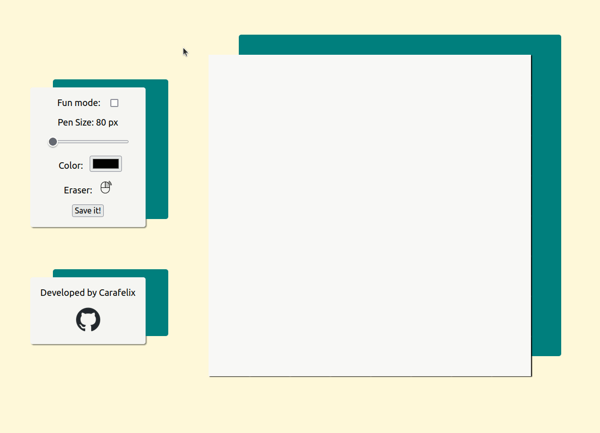

 
<h1>Paint-esque</h1>

<em>A paint-like application</em>

## Introduction

As of part of the [Odin Curriculum](https://www.theodinproject.com/lessons/foundations-etch-a-sketch), this proyect comes as challenge to archieve a simple drawing application via DOM Manipulation.

## Implementations

- Simple pleasing design with non-disturbing hover animations
- Ability to download your draw via [html2canvas](https://github.com/niklasvh/html2canvas) implemented via CDN
- Integrated HTML5 color selector
- Reset canvas on pencil re-size
- Right click eraser
- Fun mode: each time you pass over a div it increases it opacity value, plus it looks like Minesweeper

## to-do 
- [Performance boost on box-shadow animation](https://tobiasahlin.com/blog/how-to-animate-box-shadow/);

